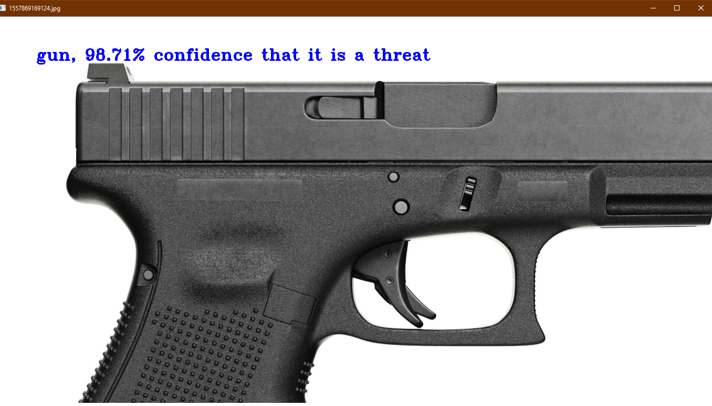
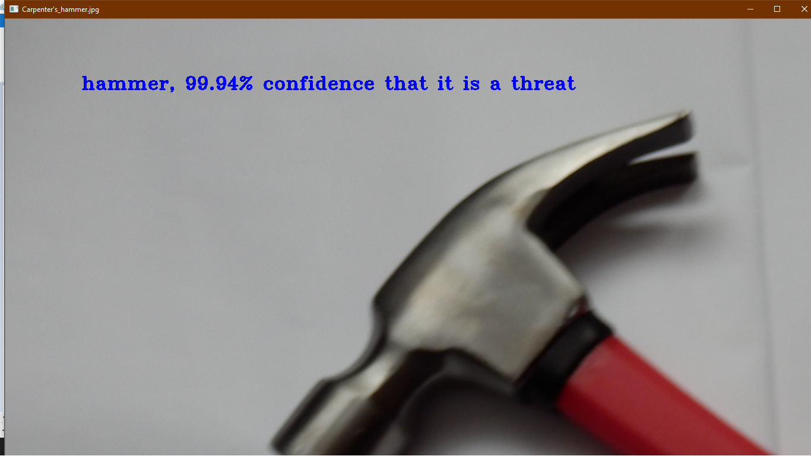
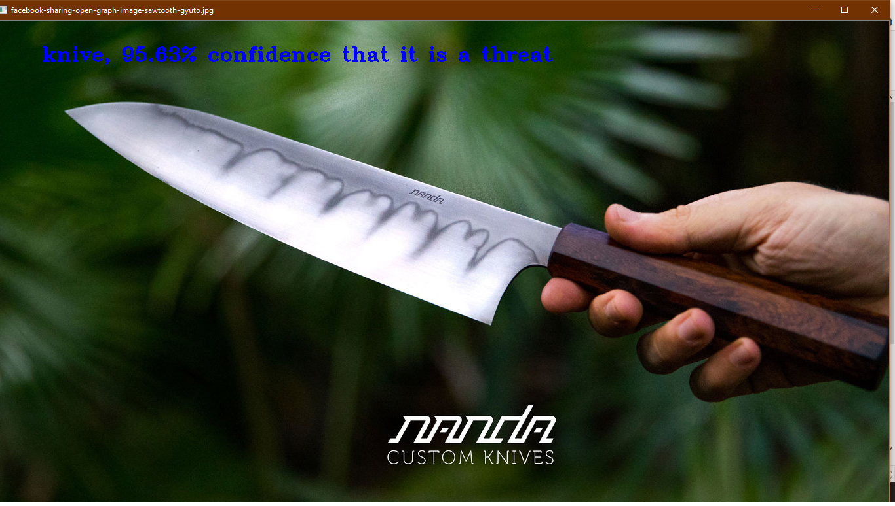

# Machine_Learning_threat_Detector
### A trained py script using tensorflow and OpenCv. It classifies the image on what threat it is and how confident.
#### Transfer learning with Inception v3 or Mobilenet models.
The script has been taken form the original file by google:
https://github.com/tensorflow/tensorflow/blob/master/tensorflow/examples/image_retraining/retrain.py

It has been modified to suit the needs and been retrained to detect threats. 

ImageNet is a common academic data set in machine learning for training an image recognition system. Code in this directory demonstrates how to use TensorFlow to train and evaluate a type of convolutional neural network (CNN) on this academic data set. In particular, we demonstrate how to train the Inception v3 architecture as specified in:

To understand the training model in depth visit this link:

https://github.com/tensorflow/models/tree/master/research/inception

This training model uses a learning method called transfer learning.

Here are some screenshots of the programm running:

